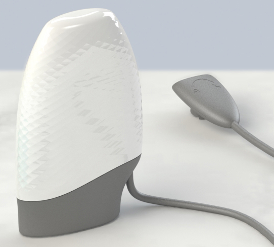
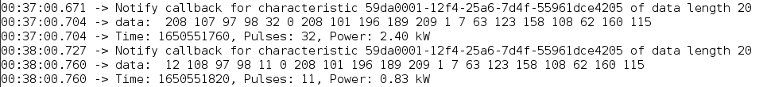
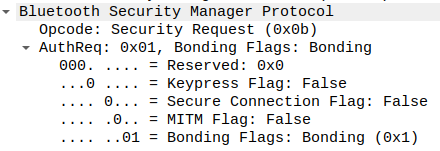

_This repository is not affiliated with Powerpal._

# powerpal_ble
Collection of code, tools and documentation for data retrieval over BLE from your Powerpal.

[*Home Assistant Community Discussion*](https://community.home-assistant.io/t/powerpal-smart-energy-monitor/263713/126)



- [Using the ESPHome Component](#using-the-esphome-component)
- [Using the Arduino sketch](#using-the-arduino-sketch)
- [BLE Documentation](#ble-documentation)
- [Powerpal API Key and Device ID](#powerpal-api-key-and-device-id)

## Using the ESPHome Component

The ESPHome component hasn't been merged into esphome yet, but you can use it via `external_components`
> :grey_exclamation: This component now supports experimental Powerpal cloud uploading!
>
> This functionality allows you to view your energy data visualisations within the Powerpal application without ever have to bother connecting your Powerpal device to your phone ever again.
>
> This feature works by retrieving the Powerpal authentication information (stored on the Powerpa device itself), and collects 15 measurements before uploading them to your Powerpal Cloud.
>
> This requires your energy cost per kWh in the configuration, and currently doesn't support peak/off-peak switching.

#### Requirements:
- An ESP32
- A configured Powerpal
- Powerpal device information:
  - BLE MAC address (can be found on device sticker, by ESPHome BLEtracker, or by using an app like nRF Connect once you have disabled the bluetooth of all your smart devices)
  - Connection pairing pin (6 digits you input when setting up your device, also can be found printed in Powerpal info pack, or inside the Powerpal application)
  - Your Smart meter pulse rate (eg. 1000 pulses = 1kW/h)
- Optionally uncomment the `http_request_id` and add your `cost_per_kwh` to enable Powerpal cloud uploading.

```yaml
external_components:
  - source: github://WeekendWarrior1/esphome@powerpal_ble
    # requires ble_client because I had to add some small features to authenticate properly
    components: [ ble_client, powerpal_ble ]

# optional requirement to enable powerpal cloud uploading
#http_request:
#  id: powerpal_cloud_uploader

# optional requirement used with daily energy sensor
time:
  - platform: homeassistant
    id: homeassistant_time

esp32_ble_tracker:

ble_client:
  - mac_address: DF:5C:55:00:00:00
    id: powerpal

sensor:
  - platform: powerpal_ble
    ble_client_id: powerpal
    power:
      name: "Powerpal Power"
    daily_energy:
      name: "Powerpal Daily Energy"
    energy:
      name: "Powerpal Total Energy"
    battery_level:
      name: "Powerpal Battery"
    pairing_code: 123123
    notification_interval: 1 # get updates every 1 minute
    pulses_per_kwh: 1000
    time_id: homeassistant_time # daily energy still works without a time_id, but recommended to include one to properly handle daylight savings, etc.
#    http_request_id: powerpal_cloud_uploader
#    cost_per_kwh: 0.20 #dollars per kWh
#    powerpal_device_id: 0000abcd #optional, component will retrieve from your Powerpal if not set
#    powerpal_apikey: 4a89e298-b17b-43e7-a0c1-fcd1412e98ef #optional, component will retrieve from your Powerpal if not set
```
You can also find a full config here: [powerpal_ble.yaml](powerpal_ble.yaml)

And the component code here: [powerpal_ble ESPHome Component](https://github.com/WeekendWarrior1/esphome/tree/powerpal_ble/esphome/components/powerpal_ble)

## Using the Arduino sketch
This sketch simply prints the timestamp, pulses and energy usage of the updates sent by the Powerpal (the update interval can also be configured).

It's mainly useful to demonstrate that the Powerpal is connectable over BLE by a third party device, without the need for the proprietary Powerpal Pro wifi gateway (which I believe also uses an ESP32).

#### Requirements:
- An ESP32
- A configured Powerpal
- Powerpal device information:
  - BLE MAC address (can be found on device sticker, by running sketch, or by using an app like nRF Connect once you have disabled the bluetooth of all your smart devices)
  - Connection pairing pin (6 digits you input when setting up your device, also can be found printed in Powerpal info pack, or inside the Powerpal application)
  - Your Smart meter pulse rate (eg. 1000 pulses = 1kW/h)


#### Fill in your details at top of esp32_ble_print_data.ino and upload:
```c++
static char *BLE_address("df:5c:55:00:00:00"); // lowercase only or else will fail to match
// if your pairing pin starts with 0, eg "024024", set the powerpal_pass_key as 24024
static uint32_t powerpal_pass_key = 123123;
static float pulses_per_kw = 1000;
static uint8_t read_every = 1; // minutes (only tested between 1 - 15 minutes)
```

#### Serial Monitor output:


## Powerpal API Key and Device ID
The Powerpal Cloud API Key is stored on the Powerpal device itself at `59DA0009-12F4-25A6-7D4F-55961DCE4205`.
The Device ID is stored at `59DA0010-12F4-25A6-7D4F-55961DCE4205`.
It can be retrieved and decoded using:
- [Python Authentication Retrieval Script](auth_extraction)
- Or both the [ESPHome Component](#using-the-esphome-component) and the [Arduino Sketch](#using-the-arduino-sketch) will print it out after establishing a BLE connection to the Powerpal

Also see [how to decode both values](#retrieving-and-decoding-cloud-api-key-and-device-id)

## BLE Documentation

#### Important BLE services
```js
SERVICE_POWERPAL_UUID: '59DAABCD-12F4-25A6-7D4F-55961DCE4205'
    Characteristics:
        // Once subscribed to notifications, sends pulses with a timestamp every ${readingBatchSize}
        measurement: '59DA0001-12F4-25A6-7D4F-55961DCE4205' // notify, read, write

        // Use to trigger notifications of historic measurements between 2 dates
        measurementAccess: '59DA0002-12F4-25A6-7D4F-55961DCE4205' // indicate, write

        // Once subscribed to notifications, sends a notification (timestamp)for every pulse. This seems to be used by the application to display instantaneous power usage. This will likely chew through battery
        pulse: '59DA0003-12F4-25A6-7D4F-55961DCE4205' // notify, read

        // Used to set the time of the Powerpal. The Powerpal seems to have a pretty good RTC and you will likely not have to set this after the powerpal has been configured in it's app
        time: '59DA0004-12F4-25A6-7D4F-55961DCE4205' // indicate, notify, read, write

        // Seems to retrieve the timestamp of the first and last datapoints stored in the Powerpal
        firstRec: '59DA0005-12F4-25A6-7D4F-55961DCE4205' // read, write

        // Used to configure the sensitivity of the pulse reading sensor (Can also be done within the app)
        ledSensitivity: '59DA0008-12F4-25A6-7D4F-55961DCE4205' // indicate, notify, read, write

        // Read or change Powerpal API key - this stores the Authorization key required to communicate with Powerpal's cloud REST APIs
        uuid: '59DA0009-12F4-25A6-7D4F-55961DCE4205' // indicate, notify, read, write

        // Read or change Powerpal Serial Number (this is also the device ID used in Powerpal's cloud REST APIs)
        serialNumber: '59DA0010-12F4-25A6-7D4F-55961DCE4205' // indicate, notify, read, write

        // needs to be written to with your powerpal pairing key before other services are accessible
        pairingCode: '59DA0011-12F4-25A6-7D4F-55961DCE4205' // indicate, notify, read, write

        // Seems to be used to calculate instantaneous power usage in app
        millisSinceLastPulse: '59DA0012-12F4-25A6-7D4F-55961DCE4205' // read

        // Can be written to to change Powerpal ${measurement} notification interval
        readingBatchSize: '59DA0013-12F4-25A6-7D4F-55961DCE4205' // indicate, notify, read, write
```
#### Connecting to a Powerpal over BLE

The Powerpal has simple authentication requirements allowing most devices and libraries to connect and pair without issue:



After connecting, to be able to read, write or subscribe to notifications of any of the Powerpal Service characteristics your pairingCode must be written to the `pairingCode` characteristic, `59DA0011-12F4-25A6-7D4F-55961DCE4205`.
Your pairingCode needs to be converted to hex and then have its bytes reversed, eg:
```c++
uint32_t powerpal_pass_key = 123123;
// in hex 01E0F3, so
uint32_t powerpal_pass_key_hex = 0x01E0F3;
// esp32 arduino BLE library needs to write data as an array of uint8_t's, so
uint8_t powerpal_pass_key_array[] = {0x00, 0x01, 0xE0, 0xF3};
// Powerpal wants this array in reversed byte order (little endian), so:
uint8_t powerpal_pass_key_array_reversed[] = {0xF3, 0xE0, 0x01, 0x00};

// now this can be written to the pairing code characteristic:
pRemoteCharacteristic_pairingcode->writeValue(powerpal_pass_key_array_reversed, sizeof(powerpal_pass_key_array_reversed), false);
```

Authentication is now complete, so time to configure the `readingBatchSize` (which also needs to be converted to hex and then have its bytes reversed):
```c++
// set update interval to every 1 minute
uint8_t newBatchReadingSize[] = {0x01, 0x00, 0x00, 0x00};
pRemoteCharacteristic_readingbatchsize->writeValue(newBatchReadingSize, sizeof(newBatchReadingSize), false);
```
> :warning: **If reducing the readingBatchSize**:
>
> If you have reduced the readingBatchSize, eg from 15m to 1m, at the time of the next update you will receive all the historic pulse updates that have been collected during the previous interval configuration. 
>This may be an issue if you are writing this data to Home Assistant, which currently doesn't support recieving historic datapoints. 
Luckily all the updates include a timestamp, so you can likely filter to only accept updates that are within +-5 seconds of the current time.

Subscribe to `measurement` notifications:
```c++
pRemoteCharacteristic_measurement->registerForNotify(powerpalCommandCallback);
```

Parse incoming `measurement` notifications:
```c++
// incoming data
// pData = [112 7 98 98 4 0 208 101 196 189 209 1 7 63 123 158 108 62 160 115]
// first 4 bytes (0-3) are a unix time stamp, again with reversed byte order (little endian)
uint32_t unix_time = pData[0];
unix_time += (pData[1] << 8);
unix_time += (pData[2] << 16);
unix_time += (pData[3] << 24);

// next 2 bytes (4+5) are the pulses within the time interval window, with reversed byte order (little endian)
uint16_t total_pulses = pData[4];
total_pulses += pData[5] << 8;
```
#### Retrieving and Decoding Cloud API Key and Device ID

Read and decode API Key:
```c++
// incoming data
// data = [0x95, 0x21, 0x0D, 0x4E, 0x89, 0x4F, 0x42, 0xB7, 0xB8, 0x82, 0x4B, 0x94, 0xDF, 0x7D, 0xAA, 0x34]
// 16 bytes in big endian order that simply need to be converted into a UUID string (lowercase and hyphens at index 8,12,16,20)
const uint8_t length = 16;
const char* hexmap[] = {"0", "1", "2", "3", "4", "5", "6", "7", "8", "9", "a", "b", "c", "d", "e", "f"};
std::string api_key;
for (int i = 0; i < length; i++) {
  if ( i == 4 || i == 6 || i == 8 || i == 10 ) {
    api_key.append("-");
  }
  api_key.append(hexmap[(data[i] & 0xF0) >> 4]);
  api_key.append(hexmap[data[i] & 0x0F]);
}
//  api_key == "95210d4e-894f-42b7-b882-4b94df7daa34";
```

Read and decode Device ID:
```c++
// incoming data
// data = [0xA7, 0x2B, 0x00, 0x00]
// 4 bytes in reversed byte order (little endian) that needs to be converted to a lowercase string
const uint8_t length = 4;
const char* hexmap[] = {"0", "1", "2", "3", "4", "5", "6", "7", "8", "9", "a", "b", "c", "d", "e", "f"};
std::string device_id;
for (int i = length-1; i >= 0; i--) {
  device_id.append(hexmap[(data[i] & 0xF0) >> 4]);
  device_id.append(hexmap[data[i] & 0x0F]);
}
//  device_id == "00002ba7";
```

Test the decoded results on a computer with curl installed:
```
curl -H "Authorization: <YOUR_API_KEY>" https://readings.powerpal.net/api/v1/device/<YOUR_DEVICE_ID>
```